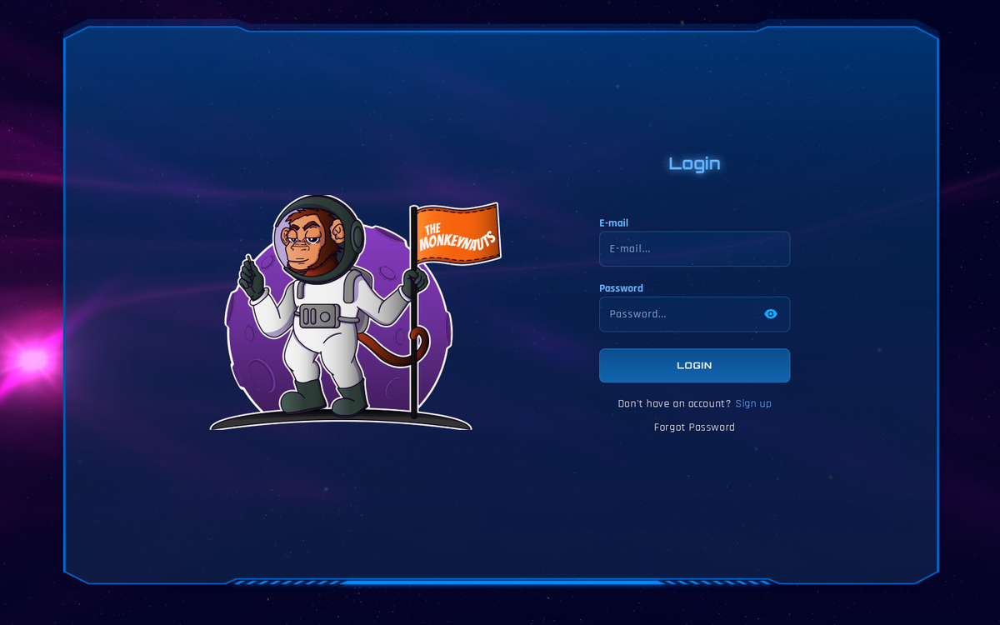
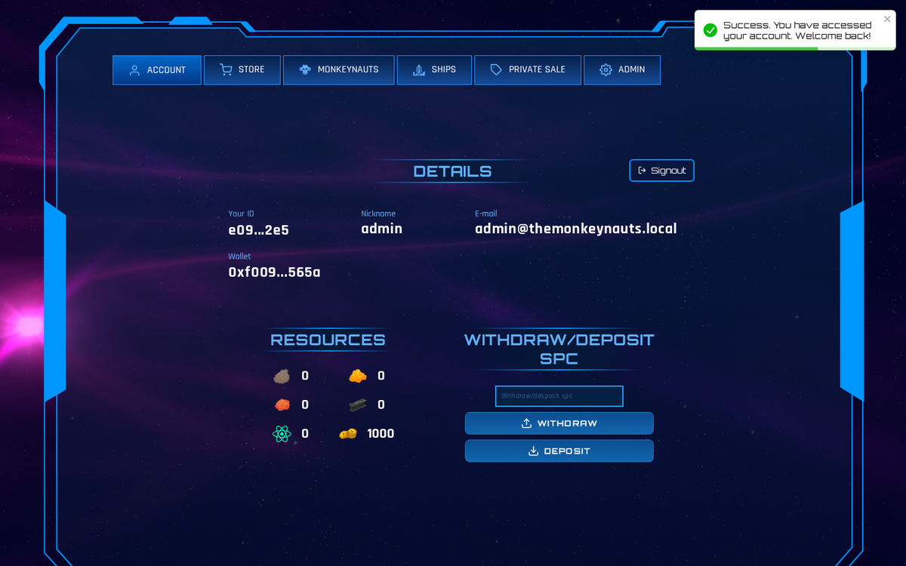
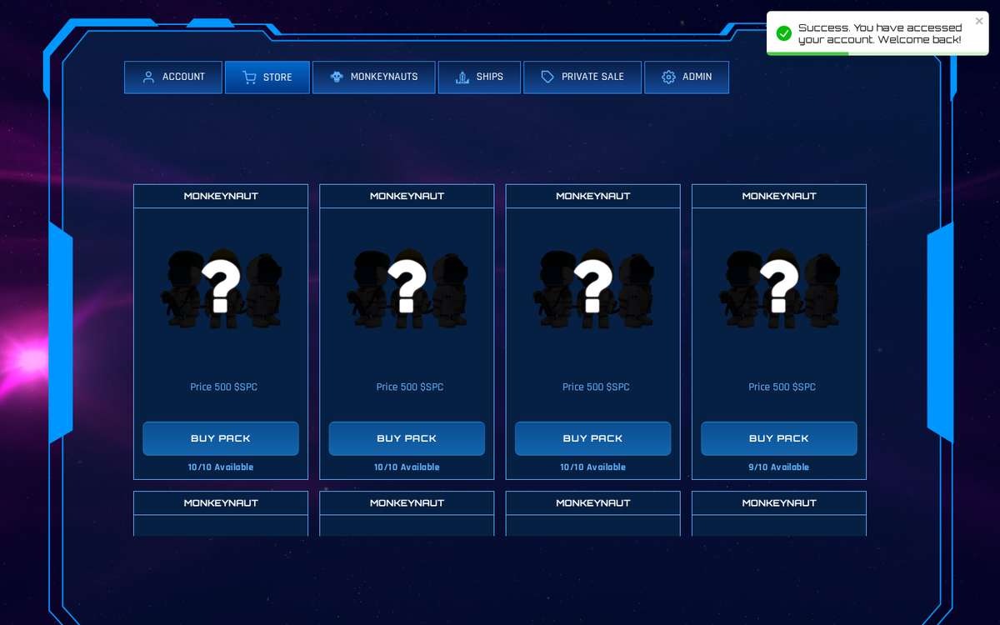
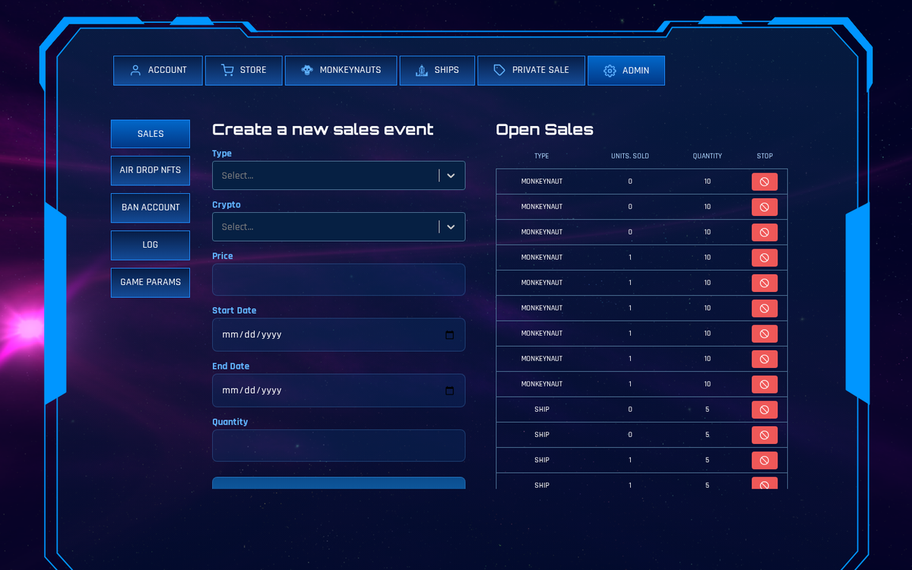

# The Monkeynauts 🚀



A space play-and-earn (P2E) game platform with ships, crews and the $SPC token on BSC, restored and modernized as a portfolio case study.

> **Monorepo**: `apps/web` (React SPA) · `apps/api` (Express + Prisma). Blockchain is optional through a `sandbox` driver (fictitious currency, fully offline) or an `rpc` driver (real BSC integration).

## Screenshots

| Account | Store |
|---|---|
|  |  |
| **Admin panel** | |



## Project goal

Bring a dead 2022 crypto game back to life as a clean, fully local, credential-free product:

- **Web dashboard** where players manage accounts, wallet, deposits/withdrawals, store purchases, ships, crews and monkeynauts
- **Admin panel** to run the game: sales events, airdrops, bans, game balance parameters and audit logs
- **API-first design**: every rule lives in the API, ready to serve any future game client
- **Zero external dependencies to run**: Postgres via Docker and a sandbox blockchain driver make the whole loop work offline

## Base languages and stack

| Layer | Technologies |
|---|---|
| **Web** | React 19, Vite, TypeScript 5, styled-components 6, react-router 7, react-hook-form + yup, axios, ethers v6 |
| **API** | Node 22, Express 5, TypeScript 5 (strict), zod, Prisma 6 + PostgreSQL, tsyringe, jsonwebtoken, ethers v6 |
| **Infra/dev** | pnpm workspaces, Docker (Postgres), tsx/tsup |

## The concept behind it

What this project demonstrates, beyond the game itself:

- **Clean Architecture**: use-cases in `core/business-logic`, domain contracts in `domain`, Prisma/HTTP only in `infra`. Dependencies always point inward
- **Explicit error handling with Either (right/left)**: every use-case signature documents its failure paths; controllers cannot ignore them
- **SOLID in practice**: single-purpose use-cases, dependency inversion through provider interfaces (the blockchain driver swaps between sandbox and real BSC without touching business rules)
- **Crypto/web3 integration done safely**: on-chain transaction validation by txHash, replay protection through unique audit logs, wallet binding
- **Teamwork and client work**: this was a real client project in 2022 that never shipped. The restoration reproduces the original domain faithfully while fixing its security bugs, which meant reading legacy code, preserving intent and documenting decisions

## Running locally (100% local, no external credentials)

```bash
# 1. dependencies
pnpm install

# 2. database (docker)
docker compose up -d
cp apps/api/.env.example apps/api/.env
cp apps/web/.env.example apps/web/.env.local

# 3. schema + admin seed
pnpm --filter api db:migrate

# 4. api (port 3333) and web (port 5173)
pnpm dev:api
pnpm dev:web   # in another terminal
```

Default accounts:
- **Admin**: `admin@themonkeynauts.local` / `Admin@1234`
- Create players through the register screen.

## Blockchain modes

| `BLOCKCHAIN_DRIVER` | Behavior |
|---|---|
| `sandbox` *(default)* | Fictitious currency. Deposits/purchases/withdrawals work offline; no chain access. Ideal for demos and tests. |
| `rpc` | Real BSC integration (`BSC_RPC_URL`) validating on-chain transactions from the official SPC contract (`SMART_CONTRACT`). Payouts require `SALES_PRIVATE_KEY`. |

The official SPC contract on mainnet was verified: symbol `SPC`, 18 decimals (~200M supply).

## API architecture

Clean architecture per module: `core/business-logic` (use-cases with tsyringe) → `domain` (entities/repositories) → `infra` (Prisma/HTTP). Details in [docs/](docs/):

- [docs/clean-architecture.md](docs/clean-architecture.md): Either right/left, DI, providers, validation
- [docs/game-guide.md](docs/game-guide.md): entities, parameters and game flows
- [docs/admin-guide.md](docs/admin-guide.md): admin/owner panel field by field
- [docs/architecture.md](docs/architecture.md): overview and restoration decisions

```
src/modules/{players,ships,monkeynauts,crews,sales,private-sales,private-p2p,game-params,logs}
src/shared/{core,domain,infra}
```

## Quality

- `pnpm --filter api typecheck`: strict TypeScript, zero errors
- E2E smoke test covering all 55 routes (register → buy → crews → fuel → bounty → withdraw → admin/owner)
- Security fixes applied over the 2022 code (plaintext password reset, privilege escalation, ban toggle without persistence)

## Roadmap

- [ ] Full mobile responsiveness polish
- [ ] Next.js / Fastify evaluation (future phase)
- [ ] CI (GitHub Actions) and automated tests
- [ ] Docker images for web/api beyond Postgres

## Author

Built by [Tiago Gonçalves de Castro](https://github.com/tiagogcastro) · [LinkedIn](https://www.linkedin.com/in/tiagogcastro)

Original project: The Monkeynauts (2022), restored in 2026 as a portfolio case study.
